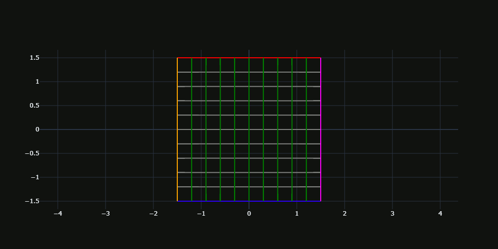
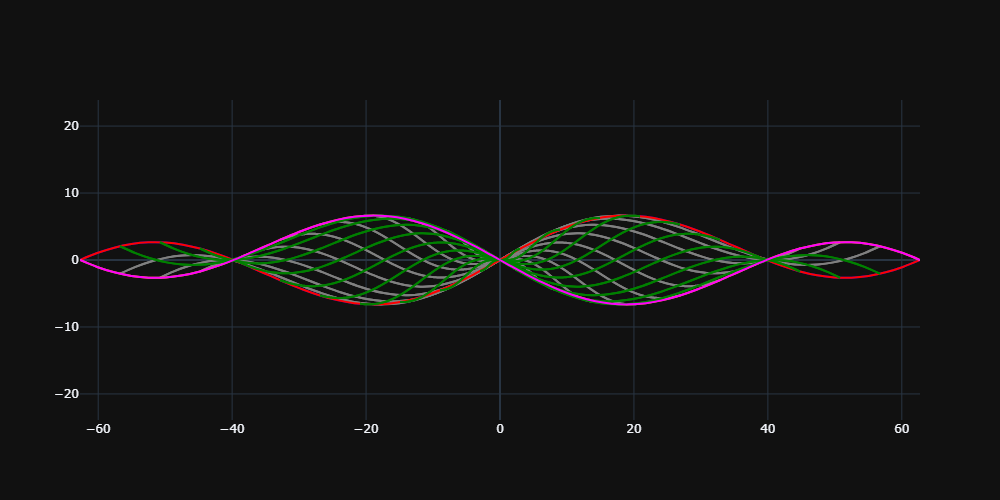
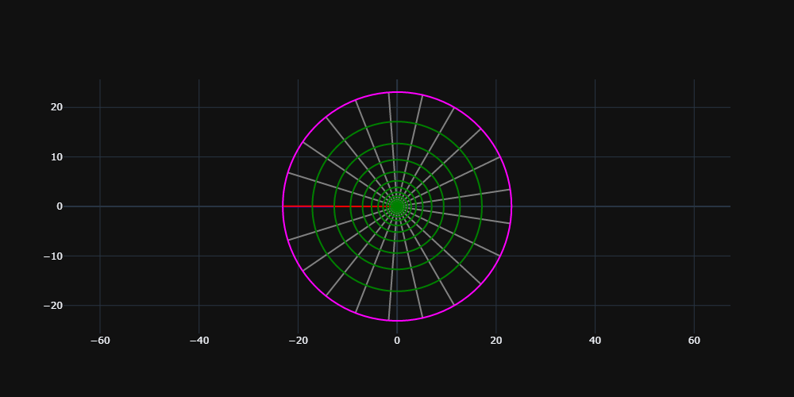

[](https://mybinder.org/v2/gh/zolabar/Conformal-Maps/HEAD)
# Conformal-Maps

The package ```conformalMappings``` is about conformal mappings and their applications. It was made to be as interactive as possible with sliders from IPyWidgets.

The aim is to create a full package of scientific Python with release, documentation, webpage etc... The package adresses students of applied sciences, lecturers, researchers and engineers and scientists at companies and anyone who wants to visualize how complex varaible mappings change plane geometries.

## Run the code

### Method 1
Use git,

&nbsp;&nbsp; &nbsp;&nbsp; copy the url from above, open the terminal and type
```
git clone URL
```
&nbsp;&nbsp;&nbsp;&nbsp; **Note** it will be cloned to current working directory.

### Method 2
&nbsp;&nbsp;&nbsp;&nbsp; Download normally from the above icon,extract it into any location.

&nbsp;&nbsp;

### How to RUN?

First install the dependencies.

system req:
```
            Jupyter lab

            Python3.7

            modules from requirements.txt

```
To install all the dependecies open therminal and type the below.
```
            pip install -r requirements.txt

                        or

            conda install --file requirements.txt

            jupyter labextension install @jupyter-widgets/jupyterlab-manager

            jupyter labextension install @jupyterlab/plotly-extension
```
Check if jupyter lab extensions are installed
```
            jupyter labextension list
```
you should get the following
```
jupyterLab v1.2.14
Known labextensions:
   app dir: $anaconda or python path$/jupyter/lab
        @jupyter-widgets/jupyterlab-manager v1.1.0  enabled  OK
        @jupyterlab/plotly-extension v1.0.0  enabled  OK
```

Alternatively, install the requirements and use ```jupyter notebook```. You can also test the code in [binder](https://mybinder.org/).

### The Fun part!!
Open terminal in the location where you have cloned/downloaded and Type
```
jupyter lab
```

Open the `final_main_output.ipynb`

And **RUN!!!**

## Examples

Here are a few preview images, that show how squares get transformed by conformal mappings.

w=e^z (origin is the square [-1.5, 1.5] x [-1.5, 1.5])


w=z^2 (origin is the square [-1.5, 1.5] x [-1.5, 1.5])


w=z^3 (origin is the square [-1.5, 1.5] x [-1.5, 1.5])


w=tan z (origin is the square [-1.5, 1.5] x [-1.5, 1.5])


w=2xy + i(y sin x - x sin y) (origin is the sqaure [-5, 5] x [-5, 5])


w=e^z (origin is the sqaure [-3.14, 3.14] x [-3.14, 3.14])


## Applications

In [PHW33](https://www.tandfonline.com/doi/abs/10.1080/14786443309462212) and [LG21](https://conference.scipy.org/proceedings/scipy2021/lauer_bare_gaertig.html) the conformal mapping between an eccentric annulus and a rectangle is used to solve a viscous flow problem analytically. The mapping is ilustrated by the following animation. The class ```RectangleToEccentricAnnulus``` from the module ```mappings``` helps to create a rectangle, that methods from ```RectangleToEccentricAnnulus``` map to a desired eccentric annulus. See also the [public github repository](https://github.com/zolabar/ConformalMappingSympy).


## References

[LG21] Lauer-Baré Z. and Gaertig E., [*Conformal Mappings with SymPy: Towards Python-driven Analytical Modeling in Physics*. Lauer-Baré, Z. & Gaertig, E. In Agarwal, M., Calloway, C., Niederhut, D., & Shupe, D., editors, Proceedings of the 20th Python in Science Conference, pages 85 - 93, 2021](https://conference.scipy.org/proceedings/scipy2021/lauer_bare_gaertig.html)

[PHW33] [Piercy N.A.V., Hooper M.S., Winny H.F., LIII. Viscous flow through pipes with cores, The London, Edinburgh, and Dublin Philosophical Magazine and Journal of Science, 1933](https://www.tandfonline.com/doi/abs/10.1080/14786443309462212)

